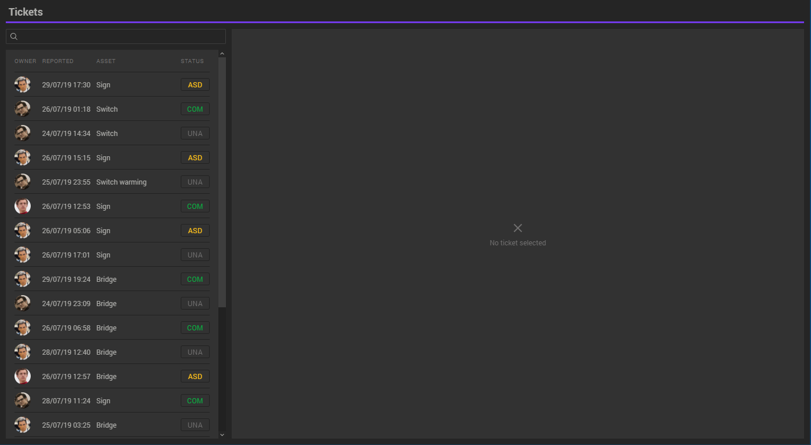
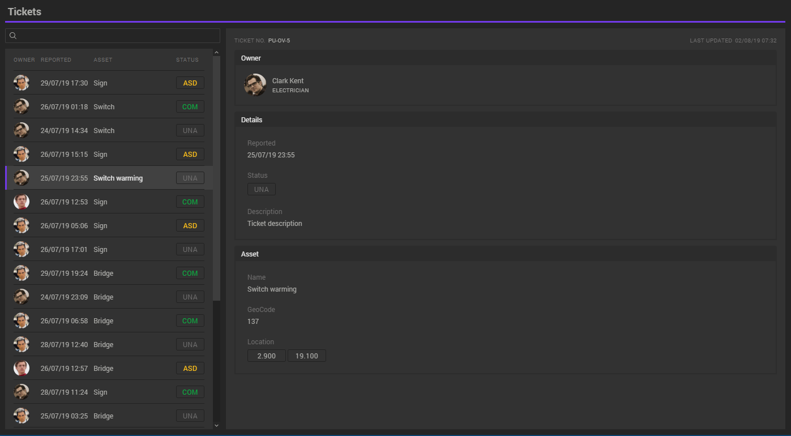

# Last Minute Challenge

Sales have passed you some mockups of a maintenance ticketing system they want to show to a potential customer in about 3 hours. They need a working prototype to help win the deal and you're the only one available to build it!

You need to create an interactive web app styled as closely as possible to the mockups provided. You may need to make some tradeoffs for things that won't be finished in the timeframe given.

- your solution must use React.js
- you can use any other libraries you like
- data must be retrieved via an api request to `api/tickets`. The `http.js` file contains a mock implementation you might want to use.
- try to get as close as you can to a solution in the next 3 hours!

Good luck!